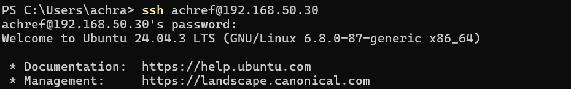
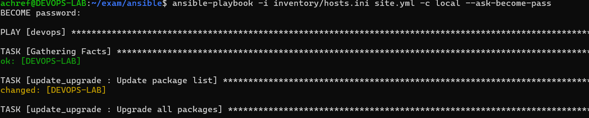
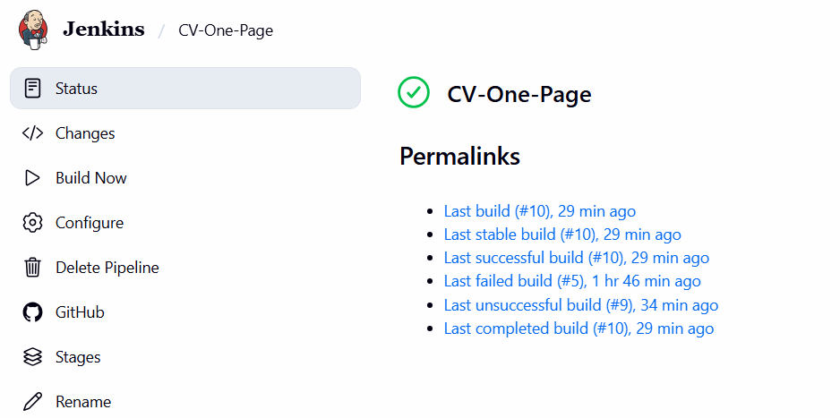
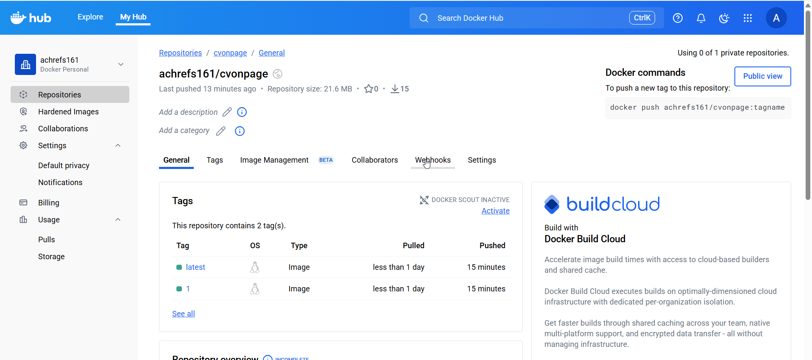
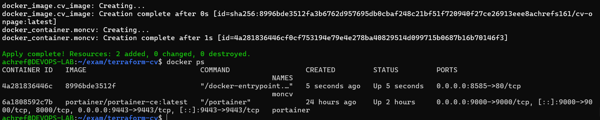
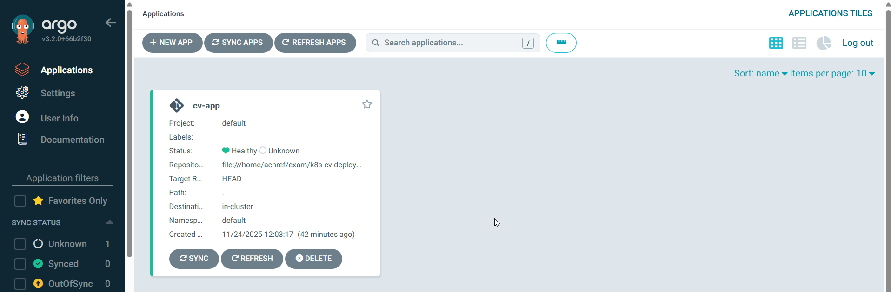
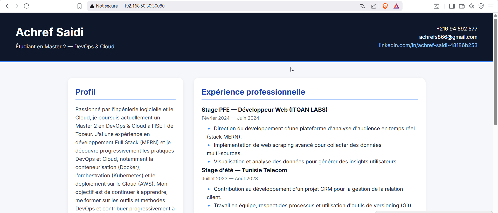

# Examen Pratique DevOps - CV One Page

Ce dépôt contient tout le travail réalisé dans le cadre de l’examen pratique DevOps sur la VM **DEVOPS-LAB**.

---

## Partie I : Préparation de l’environnement

- VM Ubuntu Server 24.04 nommée **DEVOPS-LAB** créée.
- Accès SSH configuré via clés.

**Capture d’écran :**

---

## Partie II : Automatisation avec Ansible

### Opérations automatisées :

- Mise à jour et upgrade du système.
- Installation de Docker via un rôle Ansible.
- Installation de Terraform via un rôle Ansible.
- Installation de Jenkins via un rôle Ansibl
**Captures d’écran Ansible :**

  

---

## Partie III : Pipeline CI/CD avec Jenkins

- Jenkinsfile créé et configuré.
- Pipeline qui :
  - Clone le dépôt GitHub du CV One Page.
  - Scrute l’entrepôt toutes les 5 minutes.
  - Génère l’image Docker du CV (`Dockerfile` basé sur Nginx).
  - Pousse l’image sur Docker Hub (`achrefs161/cv-onpage:latest`).
  - Envoie une notification Slack après chaque exécution.

**Capture d’écran du pipeline :**

**Logs Jenkins après push Docker :**

---

## Partie IV : Déploiement avec Terraform

- Terraform utilisé pour créer un conteneur Docker `moncv`.
- Image Docker déployée sur le port **8585**.
- Testé et accessible depuis la machine physique.

**Capture d’écran du conteneur Docker :**

---

## Partie V : Orchestration Kubernetes avec K3s et Argo CD

- **K3s Single Node** installé sur **DEVOPS-LAB**.
- Application déployée via **Argo CD** :
  - 2 replicas.
  - Service de type **NodePort** exposé sur le port `30080`.
- Vérification depuis la machine physique effectuée.

**Manifests Kubernetes :**

- `namespace.yaml`  
- `deployment.yaml`  
- `service.yaml`  
- `kustomization.yaml`  

Partie VI : Supervision et Monitoring avec Grafana Cloud

Grafana Agent installé sur DEVOPS-LAB.

Surveillance de :

La VM.

L’instance Docker.

Le cluster Kubernetes K3S.

Configuration agent-config.yaml avec prometheus et remote_write vers Grafana Cloud.

API Key utilisée pour l’authentification.

Commandes utilisées :
sudo grafana-agent --config.file=agent-config.yaml
# exam-AchrefSaidi
